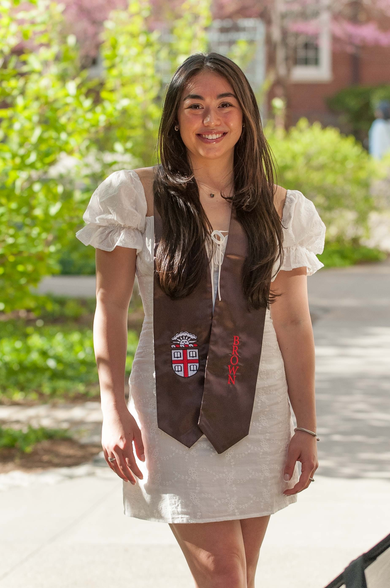

## Welcome to My Website!

I was born in Wellesley, Massachusetts, where I grew up with my parents, two older brothers, younger sister, and countless pets. I graduated from Wellesley High School in 2019 and was a Junior Olympic gymnast for the first 18 years of my life. After graduation high school, I went to my undergraduate studies at Brown University, where I studied Applied Mathematics and Biology and was a D1 student-athlete on the gymnastics team. On the team, I was an all-around competitor and was elected captain my Senior year. In 2023, I led the team to winning the Ivy Championship for the first time since 2016! I graduated from Brown University in May of 2023, and am currently pursuing my Master's in Biostatistics at Columbia Universtiy.

## My Experience

[Experience](experience.html)

